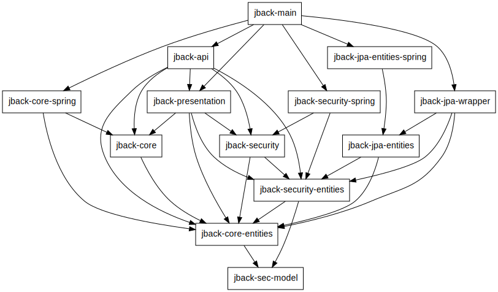

# About

This is a server backend.

# The modules

(alphabetically)

* **[jback-angular](jback-angular)** contains the angular frontend
* **[jback-api](jback-api)** defines and implements the API using Spring Web
* **[jback-core](jback-core)** provides the business logic
* **[jback-jpa](jback-jpa)** implements persistence using JPA and Spring Data
* **[jback-main](jback-main)** ties everything together to a runnable jar
* **[jback-sec-base](jback-sec-base)** declares fundamental security things shared between `jback-core` and `jback-security`
* **[jback-sec-model](jback-sec-model)** declares a simple, generic security model
* **[jback-security](jback-security)** implements security using Spring Security
* **[jback-util](jback-util)** contains basic shared code

# Compile

`mvn compile` should do (but [jback-angular](jback-angular) has some special
prerequisites). 

# Usage 

Undefined. Or self-explanatory.

# Deployment

Undefined (but [jback-main](jback-main) is currently configured to use Derby
for DB, so it will run stand-alone.)

# Requirements

Not so clear (but maybe check [here](jback-main/src/test)).
